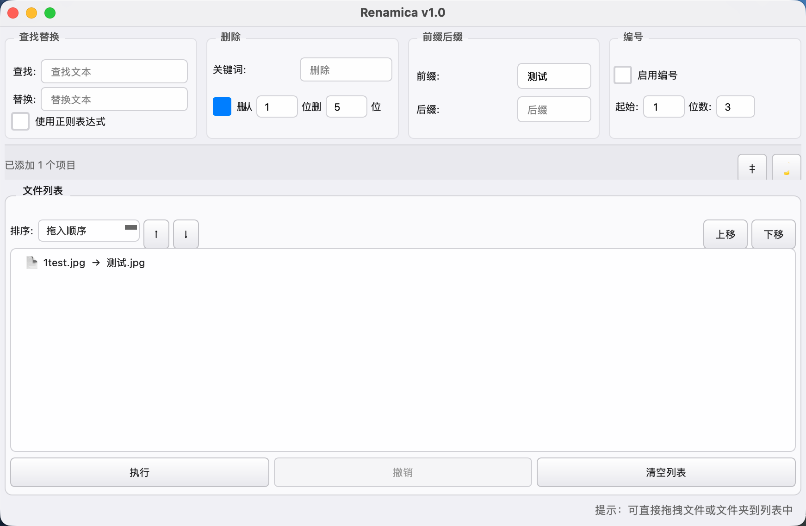

# Renamica

macOS 批量文件重命名工具，支持拖拽、实时预览、撤销、冲突检测。

[](https://github.com/Vasoura/Renamica/releases)
[](https://github.com/Vasoura/Renamica)

## 截图



## 功能

- **拖拽添加** – 把文件或文件夹拖到窗口中即可
- **查找替换** – 支持普通文本和正则表达式
- **删除** – 删除关键词，或从指定位置删除 N 个字符
- **前缀后缀** – 在文件名前或后添加文字
- **编号** – 自动编号（001, 002… 或 a, b, c…）
- **排序** – 按文件名、修改时间、创建时间、大小、文件类型排序，支持手动上移/下移
- **实时预览** – 输入规则后立刻看到改名效果
- **冲突检测** – 自动检测重复名称、非法字符、目标已存在等冲突，有冲突时禁止执行
- **撤销** – 执行后可以一键撤销上次批量改名
- **改名日志** – 每次操作自动保存到 `~/.renamica/rename_log.csv`
- **深色模式** – 支持浅色/深色切换
- **中英文切换** – 自动跟随系统语言，也可手动切换
- **macOS 原生菜单栏** – 完整菜单支持：添加文件、添加文件夹、清空列表、撤销、GitHub
- **Finder 集成** – 支持把文件拖到 Dock 图标打开，也支持右键「打开方式」

## 安装

### 下载 DMG

从 [Releases 页面](https://github.com/Vasoura/Renamica/releases) 下载 `Renamica-1.0.0.dmg`，打开后将 `Renamica.app` 拖入 Applications 文件夹即可。

### 从源码运行

```bash
# 安装依赖
pip install -r requirements.txt

# 运行
python3 Renamica.py
```

### 打包成 .app

```bash
pip install pyinstaller
pyinstaller Renamica.spec --clean --noconfirm
open dist/Renamica.app
```

## 项目结构

```
Renamica/
├── Renamica.py            # 主程序
├── Renamica.spec          # PyInstaller 打包配置
├── renamica.icns          # 应用图标
├── renamica_icon.png      # 1024×1024 源图标
├── renamica_logo.png      # Logo 源文件
├── screenshot.png         # 截图
├── convert_icon.py        # 图标生成脚本
├── requirements.txt       # 依赖
├── README.md
└── dist/
    └── Renamica.app       # 打包好的应用
```

## 使用说明

1. **添加文件** – 拖拽文件到窗口，或通过 File → Add Files / Add Folder
2. **设置规则** – 在查找替换、删除、前缀后缀、编号区域输入规则
3. **预览效果** – 右侧文件列表实时显示原名 → 新名
4. **执行** – 点击「执行」，之后可通过「撤销」恢复

如果列表底部出现红色警告，说明存在冲突，执行按钮会被禁用，修复冲突后才能执行。

## 协议

MIT
